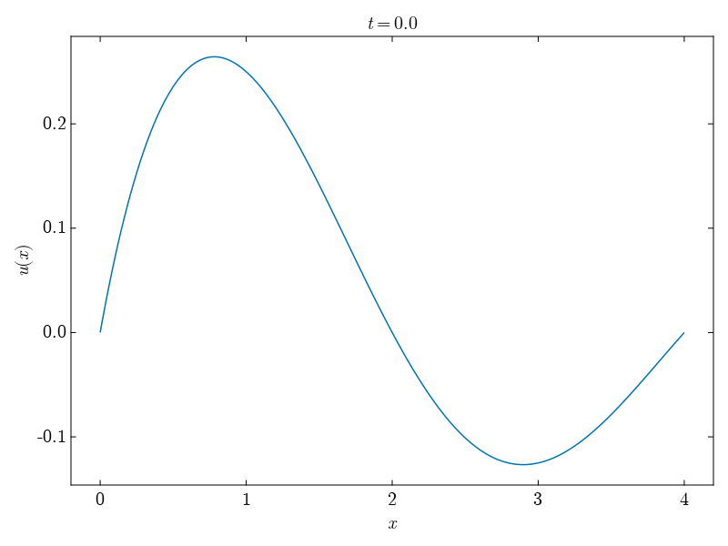
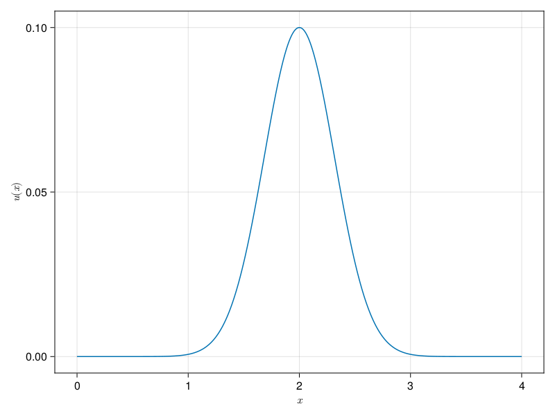

# Simulation of fluid dynamics equations

## Linear Advection Equation

The most simple example of fluid dynamics equation discribing advection (ie a quantity which is carried by the fluid) is the **linear advection equation** and reads 
$$
\partial_t u(t, x) + v \partial_x u(t, x) = 0 \; .
$$

We know the solution to this equation which is simply given by
$$
u(x, t) = f(x - vt)
$$
which mean that, for example, the initial condition will be carried along at velocity. We show this behavior in the next Figure for two Gaussian profiles.

This could for example represent the density of a fluid moving a constant velocity.

## Burger Equation

A more interesting equation, illustrating some of the most interesting aspect of fluid dynamics equation is given by the [Burger equation](https://www.wikiwand.com/en/Burgers%27_equation). It reads
$$
\partial_t u + u \partial_x u = \nu \partial^2_x u
$$

It is made of two part, a non linear advective part $u \partial_x u$ and a diffusive part $\nu \partial^2_x u$. The advective part can be understood using the linear advection equation as the velocity being a quantity which is carried by the particle and as such we can use the equation (1) with $v = u$. We will illustrate the diffusion part later and is related to viscosity in fluid.

> **Note**
> 
> The Burger equation can be obtained from the Navier-Stoke equation
> $$
> 2x + 1 = 0
> $$
> in the situation where 

### Aviscid Burger equation

For a gaussian profile with low diffusion coefficiant we find the following behavior

 

We see at the formutation of a shock wave caused by the non linear advection term, the bigger velocity will flow faster. The shock wave is characterized by discontinuity of the velocity which can be hard to handle numerically.

Here is another example where two wave of opposite velocity intersect forming a shock wave, because a small asymmetry in the  two wave is introduced the left wave still carries some momenta. 

 

### Viscid Burger equation

If we had a non negligeable viscosity term to the flow we had a new behavior the equation which tend to homogeneize the value of the velocity. We can illustrate that with the following resolution with very strong viscosity, dominating the dynamics.

Here we present a less trivial exemple where there is a competition between advection and diffusion.

